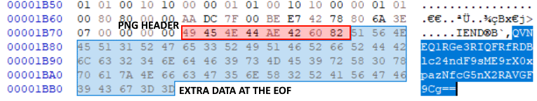

## Logarithm🪵
There is a flag hidden in this image using simple steganography techniques. Analyze the image using methods and tools of your choice to find the flag.

---

#### ➡Step-1:
We will first check the PNG File Header ```89 50 4E 47 0D 0A 1A 0A``` and PNG File Footer ```49 45 4E 44 AE 42 60 82``` using HxD (a hex editor)

---

#### ➡Step-2:
Upon closer inspection of the PNG File Footer, we can see that there is additonal data after the footer.

<center></center>

---

#### 👑Step-3:
The text looks like a **Base64** string, lets decode it using a Base64 decoder.
There is a free online one here: https://www.base64decode.org/

Base64 Input:
```
QVNEQ1RGe3RIQFRfRDBlc24ndF9sME9rX0xpazNfcG5nX2RAVGF9Cg==
```
Base64 Output:
```
ASDCTF{tH@T_D0esn't_l0Ok_Lik3_png_d@Ta}
```

After decoding the Base64 string, we find the flag: `ASDCTF{tH@T_D0esn't_l0Ok_Lik3_png_d@Ta}`

