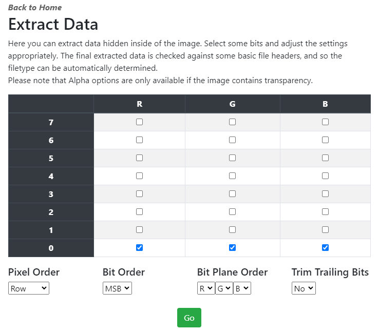

## StegOnline🌐
This is an introductory steganography challenge. Here is some guidance to help you on your way.

1. You will need an online image steganography tool. Which tool? The name of the tool is provided somewhere.
2. One of the bits has been corrupted in the R, G, and B bit representations.
3. Extract the corrupted bits stored in the R, G, and B bit representations.

---

#### ➡Step-1:
The tool is ***Steg Online*** based on the file name.

#### ➡Step-2:
Analysis of the color plane indicates there is an issue with R0, G0, B0. Maybe there is hidden data?

<center></center>

#### ➡Step-3:
Using StegOnline tool (https://georgeom.net/StegOnline/extract) to extract the data results in:

<center></center>

ASCII Output:
```
Name: Al  ex M.Age  : 32.Cit  y: Canbe  rra.Favo  urite Di  nosaur:   Spinosau  rus..Nam  e: Georg  e A.Age:   7.City:   Sydney.  Favourit  e Dinosa  ur: Velo  ciraptor  ..Name:   Mary D.A  ge: 56.C  ity: Mel  bourne.F  avourite   Dinosau  r: Bront  osaurus.  .Name: S  ophia C.  Age: 22.  City: Pe  rth.Favo  urite Di  nosaur:   Tyrannos  aurus Re  x..Name:   Alex M.  Age: 32.  City: Ca  nberra.F  avourite   Dinosau  r: Spino  saurus..  Name: Ge  orge A.A  ge: 7.Ci  ty: Sydn  ey.Favou  rite Din  osaur: V  elocirap  tor..Nam  e: Mary   D.Age: 5  6.City:   Melbourn  e.Favour  ite Dino  saur: Br  ontosaur  us..Name  : Sophia   C.Age:   22.City:   Perth.F  avourite   Dinosau  r: Tyran  nosaurus   Rex..Na  me: Alex   M.Age:   32.City:   Canberr  a.Favour  ite Dino  saur: Sp  inosauru  s..Name:   George   A.Age: 7  .City: S  ydney.Fa  vourite   Dinosaur  : Veloci  raptor..  Name: Ma  ry D.Age  : 56.Cit  y: Melbo  urne.Fav  ourite D  inosaur:   Brontos  aurus..N  ame: Sop  hia C.Ag  e: 22.Ci  ty: Pert  h.Favour  ite Dino  saur: Ty  rannosau  rus Rex.  .Name: A  lex M.Ag  e: 32.Ci  ty: Canb  erra.Fav  ourite D  inosaur:   Spinosa  urus..Na  me: Geor  ge A.Age  : 7.City  : Sydney  .Favouri  te Dinos  aur: Vel  ocirapto  r..Name:   Mary D.  Age: 56.  City: Me  lbourne.  Favourit  e Dinosa  ur: Bron  tosaurus  ..Name:   Sophia C  .Age: 22  .City: P  erth.Fav  ourite D  inosaur:   Tyranno  saurus R  ex..Name  : Stego   Saurus.A  ge: 100.  City: Ju  rassic P  ark.Favo  urite Di  nosaur:   ASDCTF{N  OM_NOM}.  .Name: A  lex M.Ag  e: 32.Ci  ty: Canb  erra.Fav  ourite D  inosaur:   Spinosa  urus..Na  me: Geor  ge A.Age  : 7.City  : Sydney  .Favouri  te Dinos  aur: Vel  ocirapto  r..Name:   Mary D.  Age: 56.  City: Me  lbourne.  Favourit  e Dinosa  ur: Bron  tosaurus  ..Name:   Sophia C  .Age: 22  .City: P  erth.Fav  ourite D  inosaur:   Tyranno  saurus R  ex.....P  ...D4(..  M ......  .bE=.j..  h.N.E.<.  ...a@O9.  B...u ".  ..Y.....  D..DF..0  ....=...  .xq.....  I$.I$...  cuR.I%jA  $.J.RI.E  B<...P..  ..Z}..[.  ......+.  ..K..i.T  .H..C..0  `.l.X.`.  ..s`..z)  Hd....Zw  ..A&.H..  ....m=.o  ..NR.`&.  .....H..  ......Zo  &H$#. "o  `..)..T.  S.......  7. ....J  .,...$.R  a.....B#  ,...Z..A  ..Z.>.$.  ...A.:.%  .I..)!`.  ..,P"...  ..Q.Z...  .\......  1..!....  I$.I$./.  ..,...B.  !jU[RI..  ....H."!  .)......  :.....(G  c"..m.K@  .C......  ......`$  .$......  )....(..  L.I*.H..  y)..I.H-  ..n.....  .N..*A.2  ...A..$.  .....`..  B.G.....  ........  ....>...  I@. .;.T  ..[#..!z  
```
Hex output:
```
4e616d653a20416c6578204d0a4167653a2033320a436974793a2043616e62657272610a4661766f75726974652044696e6f736175723a205370696e6f7361757275730a0a4e616d653a2047656f72676520410a4167653a20370a436974793a205379646e65790a4661766f75726974652044696e6f736175723a2056656c6f6369726170746f720a0a4e616d653a204d61727920440a4167653a2035360a436974793a204d656c626f75726e650a4661766f75726974652044696e6f736175723a2042726f6e746f7361757275730a0a4e616d653a20536f7068696120430a4167653a2032320a436974793a2050657274680a4661766f75726974652044696e6f736175723a20547972616e6e6f736175727573205265780a0a4e616d653a20416c6578204d0a4167653a2033320a436974793a2043616e62657272610a4661766f75726974652044696e6f736175723a205370696e6f7361757275730a0a4e616d653a2047656f72676520410a4167653a20370a436974793a205379646e65790a4661766f75726974652044696e6f736175723a2056656c6f6369726170746f720a0a4e616d653a204d61727920440a4167653a2035360a436974793a204d656c626f75726e650a4661766f75726974652044696e6f736175723a2042726f6e746f7361757275730a0a4e616d653a20536f7068696120430a4167653a2032320a436974793a2050657274680a4661766f75726974652044696e6f736175723a20547972616e6e6f736175727573205265780a0a4e616d653a20416c6578204d0a4167653a2033320a436974793a2043616e62657272610a4661766f75726974652044696e6f736175723a205370696e6f7361757275730a0a4e616d653a2047656f72676520410a4167653a20370a436974793a205379646e65790a4661766f75726974652044696e6f736175723a2056656c6f6369726170746f720a0a4e616d653a204d61727920440a4167653a2035360a436974793a204d656c626f75726e650a4661766f75726974652044696e6f736175723a2042726f6e746f7361757275730a0a4e616d653a20536f7068696120430a4167653a2032320a436974793a2050657274680a4661766f75726974652044696e6f736175723a20547972616e6e6f736175727573205265780a0a4e616d653a20416c6578204d0a4167653a2033320a436974793a2043616e62657272610a4661766f75726974652044696e6f736175723a205370696e6f7361757275730a0a4e616d653a2047656f72676520410a4167653a20370a436974793a205379646e65790a4661766f75726974652044696e6f736175723a2056656c6f6369726170746f720a0a4e616d653a204d61727920440a4167653a2035360a436974793a204d656c626f75726e650a4661766f75726974652044696e6f736175723a2042726f6e746f7361757275730a0a4e616d653a20536f7068696120430a4167653a2032320a436974793a2050657274680a4661766f75726974652044696e6f736175723a20547972616e6e6f736175727573205265780a0a4e616d653a20537465676f205361757275730a4167653a203130300a436974793a204a75726173736963205061726b0a4661766f75726974652044696e6f736175723a204153444354467b4e4f4d5f4e4f4d7d0a0a4e616d653a20416c6578204d0a4167653a2033320a436974793a2043616e626572
```

#### 👑Step-4:
Looking carefully we see and find the flag: `ASDCTF{NOM_NOM}`
